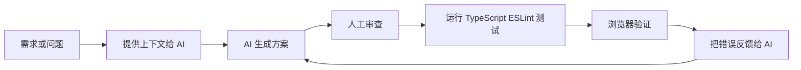

# 前端工程师如何用好 AI：从大模型原理到工程实践

> 这是一份面向前端开发工程师的 AI 使用硬核攻略。  
> 它不是简单收集 Prompt 模板，而是从大模型原理、上下文机制、信息压缩、工程协作和前端真实开发场景出发，系统讲清楚：前端工程师到底应该如何用好 AI。

---

## 目录

- [一、先建立正确的 AI 心智模型](#一先建立正确的-ai-心智模型)
- [二、大模型到底在做什么](#二大模型到底在做什么)
- [三、Transformer 架构对 Prompt 的启示](#三transformer-架构对-prompt-的启示)
- [四、为什么 Prompt 有效](#四为什么-prompt-有效)
- [五、大模型是一种压缩器](#五大模型是一种压缩器)
- [六、前端工程师使用 AI 的核心原则](#六前端工程师使用-ai-的核心原则)
- [七、前端开发中的高价值 AI 场景](#七前端开发中的高价值-ai-场景)
- [八、Prompt 的工程化设计方法](#八prompt-的工程化设计方法)
- [九、前端专用 Prompt 模板](#九前端专用-prompt-模板)
- [十、如何把 AI 融入真实工程流](#十如何把-ai-融入真实工程流)
- [十一、常见错误用法](#十一常见错误用法)
- [十二、终极原则清单](#十二终极原则清单)

---

# 一、先建立正确的 AI 心智模型

很多前端工程师使用 AI 的方式还停留在：

```text
帮我写一个组件。
帮我改一下 bug。
帮我优化一下代码。
```

这种方式不是不能用，但输出质量通常不稳定。

要真正用好 AI，你需要先建立一个底层认知：

> 大模型不是一个真正理解你项目全部上下文的程序员，而是一个基于上下文进行概率预测、模式补全、结构迁移和信息压缩/解压的系统。

所以，使用 AI 的关键不是“会不会写咒语”，而是你能不能把：

- 任务目标
- 项目上下文
- 技术约束
- 输入信息
- 输出格式
- 验收标准
- 反馈结果

组织成模型最容易理解、推理和生成的形式。

一句话：

> AI 的能力上限，取决于模型；AI 在你手里的效果上限，取决于你的上下文组织能力。

---

# 二、大模型到底在做什么

## 2.1 大模型的基础任务

大语言模型的基础任务是：

> 给定前面的文本，预测下一个 token。

可以简化表示为：

$$
P(x_t\mid x_{<t})
$$

意思是：模型根据前文 $x_{<t}$，预测当前位置 $x_t$ 最可能是什么。

训练目标通常是最小化负对数似然：

$$
\mathcal{L}=-\sum_{t=1}^{T}\log P_\theta(x_t\mid x_{<t})
$$

你给它一句话：

```text
请用 React 写一个 Modal 组件。
```

模型不是在数据库里查找某个固定答案，而是根据训练阶段学到的大量 React 组件、文档、开源项目、教程和问答中的模式，继续生成最可能合理的内容。

所以 AI 写代码的本质可以理解为：

> 在你提供的上下文条件下，做结构化的概率补全。

---

## 2.2 为什么它看起来像是在理解？

因为大模型在大规模语料中学到了非常丰富的模式，例如：

- React 组件通常如何组织
- TypeScript 类型通常如何声明
- Hooks 通常如何使用
- CSS 布局通常如何写
- API 请求通常如何封装
- 错误日志通常对应什么问题
- 架构讨论通常如何展开
- 技术文档通常如何表达

它不一定像人类一样理解，但它可以在大量上下文模式之间建立映射。

这就是为什么你问：

```text
React 中 useEffect 为什么会出现闭包问题？
```

它能回答得像一个有经验的前端工程师。

不是因为它真的运行了 React，而是因为它压缩了大量相关知识和模式。

---

# 三、Transformer 架构对 Prompt 的启示

现代大模型大多基于 Transformer 架构。

Transformer 的核心机制之一是 Self-Attention，也就是自注意力。

经典公式是：

$$
\mathrm{Attention}(Q,K,V)=\mathrm{softmax}\left(\frac{QK^\top}{\sqrt{d_k}}\right)V
$$

简单理解：

- $Q$：当前 token 想查询什么信息
- $K$：其他 token 提供什么索引
- $V$：其他 token 真正携带的内容
- $QK^\top$：计算当前 token 应该关注哪些 token
- $\mathrm{softmax}$：把注意力分数归一化
- 最后用这些权重加权汇总信息

这对前端工程师使用 AI 有几个非常重要的启示。

---

## 3.1 上下文就是模型的临时工作内存

模型不会自动知道你的项目目录、代码规范、请求封装、组件库、团队约定，除非你把这些内容提供给它，或者它通过工具读取到了。

你不应该这样问：

```text
帮我看看这个组件为什么有问题。
```

而应该这样问：

```text
下面是我的 React 组件代码、报错信息和期望行为。

技术栈：
- React 18
- TypeScript
- Vite
- Zustand
- Tailwind CSS

期望行为：
点击按钮后打开弹窗，点击遮罩关闭弹窗。

实际行为：
第一次点击正常，第二次点击弹窗不再出现。

报错信息：
...

组件代码：
...

请你：
1. 先分析最可能的原因。
2. 指出具体代码位置。
3. 给出最小修改方案。
4. 如果有多个可能原因，请按概率排序。
```

这不是“写得啰嗦”，而是在给模型建立足够的上下文。

---

## 3.2 长上下文不是越长越好

注意力机制的计算复杂度通常和上下文长度密切相关，标准 Self-Attention 的复杂度接近：

$$
O(n^2)
$$

其中 $n$ 是 token 数量。

虽然现在很多模型支持长上下文，但这不意味着你应该把整个项目全部丢进去。

长上下文会带来几个问题：

1. 成本更高
2. 响应更慢
3. 关键信息容易被淹没
4. 相似代码片段容易互相干扰
5. 模型可能抓错重点
6. 输出更容易漂移

更好的方式是：

```text
我先给你项目背景和关键文件摘要。
如果需要更多文件，请你明确告诉我需要哪个文件以及为什么。
```

前端复杂问题最好采用渐进式上下文：

1. 先给项目背景
2. 再给相关代码
3. 再给错误日志
4. 再让 AI 判断还缺什么
5. 最后进入解决方案

---

## 3.3 模型更擅长局部一致性，不擅长长期全局一致性

大模型是从左到右逐 token 生成内容的。

它没有真正运行你的代码，也不会自动知道前后所有设计一定要完全一致。

所以它可能出现这些问题：

- 前面说用 Zustand，后面突然写 Redux
- 前面定义了 `UserProfileProps`，后面使用 `ProfileProps`
- 前面要求不使用 `any`，后面偷偷写了 `any`
- 前面说不引入新库，后面加了 `lodash`
- 前面说受控组件，后面内部又维护了一套状态

所以你要让 AI 输出时保持结构化：

```text
请严格按照以下结构输出：

1. 设计思路
2. 类型定义
3. 组件实现
4. 使用示例
5. 边界情况
6. 测试建议

注意：
- 不要引入新的状态管理库。
- 不要改变已有 API。
- 不要使用 any。
- 如果必须做假设，请先列出假设。
```

结构化输出可以显著减少模型漂移。

---

# 四、为什么 Prompt 有效

## 4.1 Prompt 的本质是改变条件分布

如果你只说：

```text
帮我写一个表格组件。
```

模型面对的问题是：

$$
P(\text{输出}\mid\text{帮我写一个表格组件})
$$

这个条件非常宽泛。

它可能输出：

- React 版本
- Vue 版本
- 普通 HTML 版本
- Ant Design 版本
- Tailwind 版本
- 不带类型的版本
- 过度封装的版本
- 非常简陋的版本

但如果你说：

```text
请使用 React 18 + TypeScript + Ant Design 5 实现一个用户列表表格。

要求：
1. 支持分页。
2. 支持用户名搜索。
3. 支持状态筛选。
4. 使用 TanStack Query 请求数据。
5. 不要使用 any。
6. 不要在组件中硬编码 API URL。
7. 请求逻辑放到 hooks/useUsers.ts。
```

此时模型面对的是：

$$
P(\text{输出}\mid\text{React + TypeScript + Ant Design + TanStack Query + 具体约束})
$$

这个输出空间被显著压窄。

从信息论角度看，好的 Prompt 是在降低输出的不确定性：

$$
H(Y\mid X_{\text{好提示}})<H(Y\mid X_{\text{差提示}})
$$

这就是 Prompt 有效的原因。

它不是玄学，而是条件概率控制。

---

## 4.2 好 Prompt 不是更长，而是信息密度更高

差的 Prompt：

```text
帮我写个登录页，要好看一点。
```

好的 Prompt：

```text
请用 React 18 + TypeScript + Ant Design 5 写一个登录页。

功能要求：
1. 支持用户名和密码登录。
2. 用户名必填。
3. 密码至少 8 位。
4. 登录按钮需要 loading 状态。
5. 登录失败展示错误提示。
6. 登录成功后跳转到 /dashboard。
7. 使用 react-router-dom 的 useNavigate。
8. API 从 api/auth.ts 引入 login 函数。

约束：
1. 不要在组件里直接写 fetch。
2. 不要使用 any。
3. 不要引入新的第三方库。
4. 输出完整组件代码。
```

好 Prompt 的核心不是文字多，而是：

- 上下文明确
- 目标明确
- 约束明确
- 输出格式明确
- 验收标准明确

---

# 五、大模型是一种压缩器

## 5.1 预训练是在压缩互联网知识

从某种角度看，大模型是在把海量文本、代码、文档、教程、开源项目和问答中的统计规律压缩进参数 $\theta$ 中。

模型参数不是数据库。

它不是原样保存所有训练数据，而是保存大量模式、结构、语义关联和经验分布。

它学会了很多前端相关模式：

- React 组件如何写
- Hooks 常见用法
- TypeScript 泛型如何组织
- CSS Flex/Grid 如何布局
- API 请求如何封装
- 表单校验如何处理
- 前端路由如何组织
- 构建工具如何配置
- 常见报错如何排查
- 性能优化有哪些套路

所以，你问 AI 技术问题，本质上是在让它从压缩后的模式空间中解压出一个可能答案。

---

## 5.2 你的 Prompt 也是一种压缩

你的真实需求可能非常复杂：

- 业务目标
- 用户流程
- 技术栈
- 组件库
- 代码规范
- 团队约定
- 历史包袱
- 接口格式
- 权限规则
- 性能限制
- UI 规范
- 浏览器兼容性

但你如果只说：

```text
帮我写个用户管理页面。
```

这就是严重欠压缩。

模型只能根据通用经验猜。

更好的表达是：

```text
我要实现一个后台管理系统的用户管理页面。

技术栈：
- React 18
- TypeScript
- Ant Design 5
- TanStack Query
- Vite

功能：
1. 用户列表表格。
2. 支持分页。
3. 支持按用户名搜索。
4. 支持状态筛选。
5. 支持启用/禁用用户。
6. 支持创建用户。

接口约定：
- 列表接口返回 { list, total }
- 创建接口成功后需要刷新列表

工程约束：
1. API 请求写在 api/user.ts。
2. 请求 hooks 写在 hooks/useUsers.ts。
3. 页面写在 pages/UserManage.tsx。
4. 不使用 any。
5. 不引入新依赖。

请输出：
1. 类型定义
2. API 函数
3. hooks
4. 页面组件
```

这才是高质量压缩。

---

## 5.3 维护项目级 AI 上下文

对于长期项目，建议你维护一个 `AI_CONTEXT.md` 文件。

示例：

```md
# AI_CONTEXT

## 项目背景

这是一个 B2B SaaS 后台管理系统，用于管理客户、订单、权限和报表。

## 技术栈

- React 18
- TypeScript
- Vite
- TanStack Query
- Zustand
- Ant Design 5
- React Router 6

## 目录约定

- src/pages：页面组件
- src/components：通用组件
- src/features：业务模块
- src/api：接口请求
- src/hooks：通用 hooks
- src/stores：状态管理
- src/types：全局类型

## 代码规范

- 禁止使用 any
- 所有接口返回值必须声明类型
- 异步请求统一通过 request.ts
- 错误提示统一使用 message.error
- 表格页统一使用 useQuery
- 表单提交统一处理 loading 状态

## 禁止事项

- 不要引入未讨论的新依赖
- 不要重写无关文件
- 不要修改接口返回结构
- 不要改变已有组件对外 API
```

之后每次让 AI 写代码或分析问题时，把这个上下文一起给它，输出质量会明显提升。

---

# 六、前端工程师使用 AI 的核心原则

## 6.1 不要只给任务，要给成功标准

差的问法：

```text
帮我优化这个组件。
```

好的问法：

```text
请优化下面这个 React 组件。

优化目标按优先级排序：
1. 减少不必要的重复渲染。
2. 提高代码可读性。
3. 保持现有 API 不变。
4. 不引入新的第三方库。
5. 不改变视觉表现。

请输出：
1. 当前性能问题分析。
2. 哪些地方会导致重复渲染。
3. 修改后的代码。
4. 修改前后差异说明。
5. 可能的副作用。
```

AI 很依赖目标函数。

你不给目标，它会自己猜目标。

---

## 6.2 把 AI 当成概率型高级助手，不是权威

AI 会一本正经地胡说。

这不是因为它故意骗你，而是因为它的目标不是证明真理，而是生成在当前上下文下高概率合理的文本。

这些场景尤其容易出错：

- 新版本框架 API
- 小众库
- 公司内部封装
- 复杂异步竞态
- 浏览器兼容边界
- 构建工具细节
- 安全相关问题
- 性能瓶颈判断
- 线上事故根因分析

所以你必须建立验证闭环：



AI 最适合参与这个循环，而不是替代整个循环。

---

## 6.3 让 AI 先做设计，再写代码

直接让 AI 写代码，容易出现边想边写、结构混乱的问题。

更好的方式：

```text
请先不要写代码。
先根据需求给出组件设计方案，包括：

1. 组件职责边界
2. props 设计
3. 状态管理方式
4. 副作用处理
5. 可访问性要求
6. 边界情况
7. 测试点

我确认后，你再写代码。
```

这类似工程中的设计评审。

复杂组件尤其应该这样做。

---

## 6.4 重构时必须声明不变量

AI 重构代码时，如果你不告诉它什么不能变，它很可能会：

- 改 props
- 改 API
- 改交互
- 改样式
- 改目录结构
- 引入新依赖
- 重写无关逻辑

正确方式：

```text
请重构下面代码。

重构目标：
1. 拆分过长组件。
2. 提取重复逻辑。
3. 提升可读性。

必须保持不变：
1. 对外 props 不变。
2. UI 表现不变。
3. 用户交互不变。
4. API 调用时机不变。
5. 不引入新库。

请输出：
1. 重构思路
2. 拆分后的文件结构
3. 关键代码
4. 风险点
```

“不变量”是重构 Prompt 的核心。

---

## 6.5 Debug 时必须提供证据

不要这样问：

```text
为什么页面白屏？
```

应该这样问：

```text
我的 Vite + React 项目在生产环境部署后白屏。

开发环境：
正常。

生产环境：
白屏。

浏览器控制台报错：
...

Network：
- index.html 200
- assets/index.xxx.js 200
- assets/index.xxx.css 404

vite.config.ts：
...

部署路径：
https://example.com/admin/

请你分析：
1. 最可能原因。
2. vite base 配置是否有问题。
3. 路由 basename 是否需要配置。
4. 如何验证。
5. 给出修改方案。
```

AI 不是神谕机，它需要证据。

---

# 七、前端开发中的高价值 AI 场景

## 7.1 需求拆解

适合让 AI 把产品需求转成工程任务。

Prompt：

```text
下面是一段产品需求，请你作为前端技术负责人进行拆解。

请输出：
1. 页面结构
2. 组件拆分
3. 状态模型
4. API 需求
5. 边界情况
6. 权限点
7. 前端风险
8. 测试用例
9. 开发排期建议

产品需求：
...
```

---

## 7.2 组件 API 设计

很多前端代码难维护，不是因为实现差，而是组件 API 设计差。

Prompt：

```text
我要设计一个通用 FilterPanel 组件，用于后台列表筛选。

场景：
- 用户列表
- 订单列表
- 审批列表

筛选项类型：
- input
- select
- dateRange
- cascader

要求：
1. 支持受控和非受控模式。
2. 支持默认值。
3. 支持重置。
4. 支持自定义渲染。
5. TypeScript 类型要友好。
6. 不要过度抽象。

请你先设计 props API，不要写实现。
并给出 3 个使用示例。
```

---

## 7.3 代码生成

AI 适合生成样板代码，例如：

- CRUD 页面
- 表单页面
- 表格页面
- hooks
- API 类型
- Storybook stories
- 单元测试
- mock 数据
- 类型声明
- 工具函数
- CSS 布局

但要给足约束。

Prompt：

```text
请使用 React 18 + TypeScript + Ant Design 5 实现一个用户管理页面。

要求：
1. 页面包含搜索表单、用户表格、新建用户按钮。
2. 使用 TanStack Query 获取列表。
3. 使用 Modal + Form 创建用户。
4. 所有 API 调用从 api/user.ts 引入。
5. 不要在组件里硬编码 URL。
6. 不要使用 any。
7. 表格列包括：用户名、邮箱、状态、创建时间、操作。
8. 状态字段需要用 Tag 展示。
9. 操作包含启用/禁用。

请输出：
1. types/user.ts
2. api/user.ts
3. pages/UserManage.tsx
```

---

## 7.4 代码 Review

Prompt：

```text
你是一个严格的前端代码审查者。

请 review 以下代码，重点关注：
1. 逻辑错误
2. 类型安全
3. React hooks 依赖
4. 性能问题
5. 异步竞态
6. 内存泄漏
7. 可访问性
8. 可维护性
9. 代码风格
10. 可测试性

要求：
1. 不要泛泛而谈。
2. 每个问题都要指出具体代码位置。
3. 每个问题都要给出修改建议。
4. 如果没有明显问题，请说明没有发现。

代码：
...
```

---

## 7.5 性能优化

性能优化不要泛泛而谈，要结合证据。

Prompt：

```text
请分析下面 React 页面性能问题。

已知现象：
1. 首次加载慢。
2. 输入搜索框时表格明显卡顿。
3. 切换 tab 后重复请求接口。
4. Chrome Performance 中看到 Long Task。

技术栈：
- React 18
- Ant Design Table
- TanStack Query
- Zustand

请从以下角度分析：
1. 渲染次数
2. 组件拆分
3. useMemo/useCallback 是否必要
4. 表格虚拟滚动
5. 请求缓存
6. bundle 拆分
7. lazy load
8. 图片和静态资源
9. 如何用工具验证

请不要泛泛而谈，要结合代码指出具体问题。
```

---

## 7.6 测试生成

AI 很适合帮你生成测试用例。

Prompt：

```text
请为下面 React 组件编写测试。

技术栈：
- Vitest
- React Testing Library
- TypeScript

测试目标：
1. 正常渲染。
2. 用户点击按钮后触发 onSubmit。
3. 表单校验错误时不提交。
4. loading 状态下按钮 disabled。
5. 异步请求失败时展示错误信息。

要求：
1. 不测试实现细节。
2. 优先从用户行为角度测试。
3. mock API 请求。
4. 给出完整测试代码。
```

---

# 八、Prompt 的工程化设计方法

一个高质量 Prompt 通常包含这些模块：

```text
角色：
你是谁，以什么视角回答。

背景：
项目是什么，技术栈是什么，已有约束是什么。

任务：
要解决什么问题。

输入：
代码、错误、接口、设计稿描述、数据结构。

输出格式：
希望以什么结构返回。

约束：
不能做什么，必须做什么。

成功标准：
什么样的答案才算好。

验证方式：
如何确认方案正确。
```

可以抽象成：

```text
[角色] + [背景] + [任务] + [上下文] + [约束] + [输出格式] + [验收标准]
```

---

## 8.1 通用高质量 Prompt 模板

```text
你是一个资深前端架构师，擅长 React、TypeScript、工程化和性能优化。

背景：
我正在开发一个后台管理系统。

技术栈：
- React 18
- TypeScript
- Vite
- TanStack Query
- Zustand
- Ant Design 5

任务：
请帮我实现/分析/重构下面的问题。

上下文：
...

约束：
1. 不要使用 any。
2. 不要引入新的第三方库。
3. 保持现有 API 不变。
4. 优先使用函数组件和 hooks。
5. 如果信息不足，请先提问，不要强行假设。

输出格式：
1. 问题分析
2. 方案设计
3. 代码实现
4. 风险点
5. 测试建议

验收标准：
1. TypeScript 类型正确。
2. 代码可维护。
3. 不破坏现有行为。
4. 能解释为什么这么设计。
```

---

## 8.2 为什么“角色设定”有用，但不要迷信

角色设定有一定作用，例如：

```text
你是一个资深前端架构师。
```

它会激活模型训练语料中“专家回答”的风格分布。

但它不是最重要的。

真正重要的是：

1. 上下文是否充分
2. 任务是否明确
3. 约束是否清晰
4. 输出格式是否稳定
5. 验收标准是否明确
6. 是否有反馈循环

角色设定只是弱引导。

不要以为写一句“你是专家”，模型就能突破信息不足。

---

## 8.3 为什么举例特别有用

大模型非常擅长模式迁移。

如果你给它一个例子，它会按照例子延续风格。

这叫 few-shot prompting。

例如：

```text
这是我们项目中的 API 写法示例：

export interface GetUserListParams {
  page: number;
  pageSize: number;
  keyword?: string;
}

export function getUserList(params: GetUserListParams) {
  return request.get<UserListResponse>('/users', { params });
}

请按照这个风格，帮我写订单模块的 API。
```

这比单纯说“按最佳实践写”有效得多。

因为“最佳实践”是模糊的，而“示例”是高密度上下文。

---

# 九、前端专用 Prompt 模板

## 9.1 组件实现模板

```text
你是一个资深 React + TypeScript 前端工程师。

请实现一个组件：...

技术栈：
- React 18
- TypeScript
- CSS Modules

功能要求：
1. ...
2. ...
3. ...

组件 API：
...

约束：
1. 不使用 any。
2. 不引入第三方库。
3. 支持键盘操作。
4. 注意可访问性。
5. 保持组件职责单一。

请输出：
1. 类型定义
2. 组件代码
3. 样式代码
4. 使用示例
5. 边界情况说明
```

---

## 9.2 Bug 分析模板

```text
你是一个资深前端调试专家。

技术栈：
...

问题描述：
...

期望行为：
...

实际行为：
...

触发步骤：
...

相关代码：
...

报错信息：
...

请你：
1. 按概率排序列出可能原因。
2. 指出最关键的代码位置。
3. 给出最小修改方案。
4. 说明为什么这个修改有效。
5. 给出后续验证步骤。
```

---

## 9.3 重构模板

```text
你是一个前端架构师，请帮我重构下面代码。

重构目标：
1. 降低复杂度。
2. 提高可读性。
3. 提取可复用逻辑。
4. 改善类型定义。

不允许改变：
1. 对外 props。
2. 用户交互。
3. API 调用方式。
4. UI 展示效果。

请输出：
1. 重构前问题分析
2. 重构方案
3. 修改后的代码
4. 修改点说明
5. 风险和测试建议
```

---

## 9.4 性能优化模板

```text
你是一个 React 性能优化专家。

请分析以下页面性能问题。

已知现象：
...

技术栈：
...

相关代码：
...

请从以下维度分析：
1. 重复渲染
2. 状态设计
3. props 稳定性
4. useMemo/useCallback 是否必要
5. 列表虚拟化
6. 请求缓存
7. bundle size
8. 懒加载
9. 浏览器渲染成本
10. 如何用工具验证

请输出：
1. 最可能的瓶颈
2. 证据
3. 优化方案
4. 修改代码
5. 验证方式
```

---

## 9.5 自测 Checklist 模板

```text
请根据下面组件功能，生成前端自测 checklist。

请覆盖：
1. 正常流程
2. 空数据
3. 加载中
4. 请求失败
5. 权限不足
6. 表单校验
7. 边界输入
8. 移动端
9. 键盘操作
10. 可访问性

组件功能：
...
```

---

# 十、如何把 AI 融入真实工程流

## 10.1 需求阶段

让 AI 帮你向产品经理提问题。

```text
下面是产品需求，请你站在前端负责人角度，列出需要向产品经理确认的问题。

请从这些方面提问：
1. 用户流程
2. 权限
3. 边界状态
4. 错误状态
5. 空状态
6. 加载状态
7. 移动端适配
8. 国际化
9. 数据量
10. 埋点

产品需求：
...
```

---

## 10.2 设计阶段

让 AI 帮你做组件拆分和数据流设计。

```text
请根据下面页面需求设计前端组件结构。

要求输出：
1. 页面级组件
2. 业务组件
3. 通用组件
4. hooks
5. store
6. API 模块
7. 类型定义
8. 数据流说明

页面需求：
...
```

---

## 10.3 编码阶段

让 AI 生成初稿，但你负责控制架构。

```text
请根据这个设计生成第一版代码。

注意：
1. 先生成类型定义。
2. 再生成 API 层。
3. 再生成 hooks。
4. 最后生成 UI 组件。
5. 每部分代码不要混在一起。
```

---

## 10.4 Review 阶段

让 AI 做第二审查人。

```text
下面是一个 Pull Request 的 diff。

请帮我 review：
1. 是否有逻辑 bug。
2. 是否破坏兼容性。
3. 是否有潜在性能问题。
4. 是否有安全风险。
5. 是否需要补测试。
6. 给出 review comment。

diff：
...
```

---

## 10.5 线上问题排查

把 Sentry、日志、用户路径交给 AI 进行辅助分析。

```text
下面是 Sentry 中同类错误的聚合信息。

错误：
...

堆栈：
...

用户操作路径：
...

浏览器和设备：
...

最近发布内容：
...

请分析：
1. 最可能根因。
2. 影响范围。
3. 复现路径。
4. 临时止血方案。
5. 长期修复方案。
```

---

# 十一、常见错误用法

## 11.1 提示太短

错误：

```text
帮我写个登录页。
```

问题：

- 没有技术栈
- 没有交互要求
- 没有接口约定
- 没有校验规则
- 没有路由跳转
- 没有代码风格约束

改进：

```text
请用 React 18 + TypeScript + Ant Design 5 写一个登录页。

要求：
1. 支持用户名和密码登录。
2. 表单校验：用户名必填，密码至少 8 位。
3. 登录按钮 loading。
4. 登录失败展示错误提示。
5. 登录成功后跳转到 /dashboard。
6. 使用 react-router-dom 的 useNavigate。
7. API 从 api/auth.ts 引入 login 函数。
8. 不要在组件中直接写 fetch。
```

---

## 11.2 不给代码，只给现象

错误：

```text
为什么 useEffect 无限循环？
```

改进：

```text
下面是我的 useEffect 代码，它出现了无限循环。

代码：
...

依赖数组：
...

相关 state：
...

请分析：
1. 哪个依赖导致循环。
2. 为什么会循环。
3. 如何最小修改。
4. 是否需要 useMemo/useCallback。
```

---

## 11.3 一次让 AI 做太多

错误：

```text
帮我设计架构、写代码、写测试、优化性能、写文档。
```

改进：

```text
我们分阶段进行。

第一阶段：
请只做架构设计，不写代码。

第二阶段：
我确认设计后，再生成核心代码。

第三阶段：
再补测试和文档。
```

复杂任务一定要拆阶段。

---

## 11.4 不告诉 AI 禁止事项

AI 可能会擅自：

- 引入 lodash
- 引入 dayjs
- 引入 Zustand
- 设计一套路由
- 改目录结构
- 使用 any
- 改接口格式
- 重写无关代码

所以要明确写：

```text
禁止事项：
1. 不要引入新依赖。
2. 不要修改接口返回结构。
3. 不要改变现有 props。
4. 不要使用 any。
5. 不要重写无关代码。
```

---

# 十二、终极原则清单

前端工程师用好 AI，可以记住这 12 条：

1. 上下文质量决定输出质量。
2. Prompt 不是咒语，而是条件概率控制。
3. 角色设定有用，但远不如具体约束有用。
4. 给示例比讲抽象原则更有效。
5. 复杂任务要分阶段，不要一口气全做。
6. 让 AI 先设计，再写代码。
7. 重构时必须声明不变量。
8. Debug 时必须给代码、报错、复现步骤。
9. 性能优化必须结合工具验证。
10. AI 输出的代码必须经过 TypeScript、ESLint、测试和浏览器验证。
11. 维护项目级 AI 上下文，比每次重新解释更高效。
12. 你越像架构师一样提问，AI 越像高级工程师一样回答。

---

# 最后总结

AI 最擅长的不是替你写代码，而是放大你的工程意图。

如果你自己不知道要什么，AI 会生成一堆看似合理但不可控的代码。

如果你能清楚定义：

- 目标
- 约束
- 架构
- 输入
- 输出
- 验收标准

AI 就会非常强。

真正会用 AI 的前端工程师，不是让 AI 替自己思考，而是把 AI 接入自己的工程思维系统里。

一句话总结：

> 把 AI 当成一个拥有海量模式知识、但没有项目真实上下文和执行能力的概率型协作者；你负责提供高密度上下文、明确约束、定义验收标准，并通过工程工具验证结果。

